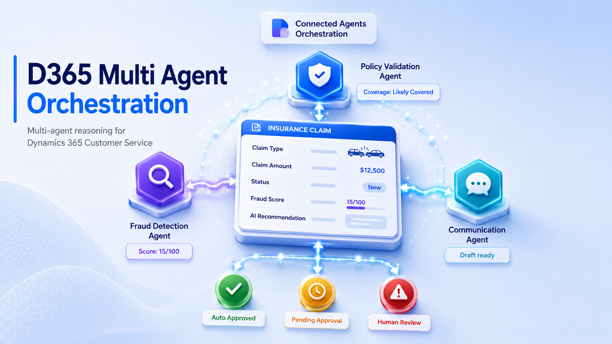
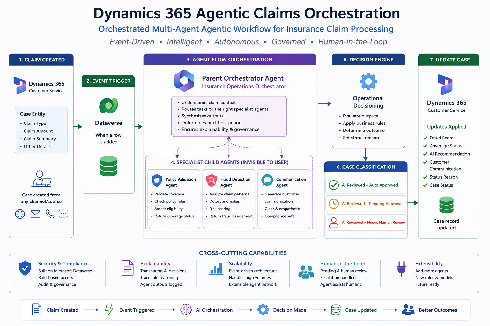
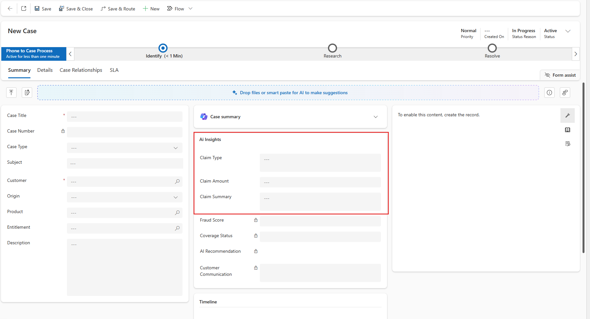
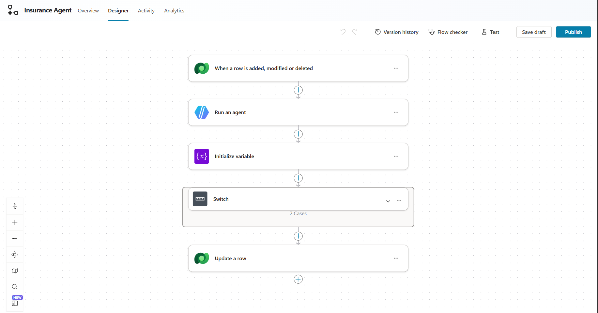
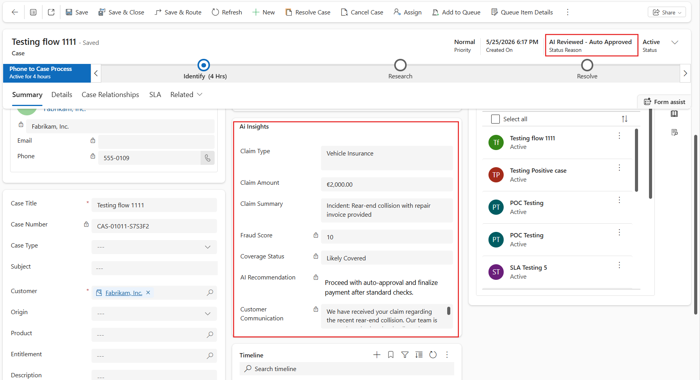

# Dynamics365-Agentic-Claims-Orchestration

> Enterprise Agentic AI Operations Blueprint for Insurance Claims Processing using Microsoft Dynamics 365, Copilot Studio, Dataverse, and Agent Flows.



---

# Overview

This project demonstrates an orchestrated multi-agent agentic workflow architecture built on Microsoft Dynamics 365 Customer Service and Microsoft Copilot Studio for intelligent insurance claims processing.

The solution uses event-driven AI orchestration to automatically analyze newly created insurance claims, assess fraud risk, validate likely policy coverage, generate customer-safe communication, and dynamically determine operational outcomes such as:

- AI Reviewed – Auto Approved
- AI Reviewed – Pending Approval
- AI Reviewed – Needs Human Review

The architecture is designed around a parent orchestrator agent with hidden specialist child agents operating as invisible operational intelligence layers inside Dynamics 365.

---

# Why This Project Exists

Traditional CRM workflows are primarily deterministic and rule-based.

This project demonstrates how enterprise AI agents can operate as intelligent operational layers inside Dynamics 365 rather than standalone conversational assistants.

The system transforms Dynamics 365 Customer Service into an AI-native operational platform capable of:

- autonomous claim analysis
- dynamic workflow orchestration
- fraud intelligence
- operational decisioning
- human-in-the-loop governance
- real-time case enrichment

---

# Architecture Overview

## High-Level Workflow

```text
Case Created in Dynamics 365
            ↓
Dataverse Event Trigger
            ↓
Agent Flow Orchestration
            ↓
Parent Insurance Operations Agent
            ↓
Hidden Specialist Child Agents
    ├── Policy Validation Agent
    ├── Fraud Detection Agent
    └── Communication Agent
            ↓
Operational Decision Engine
            ↓
Case Classification
    ├── AI Reviewed – Auto Approved
    ├── AI Reviewed – Pending Approval
    └── AI Reviewed – Needs Human Review
            ↓
Dynamics 365 Case Updated
```

---

# Key Features

- Event-driven AI orchestration
- Dynamics 365 native integration
- Parent-child agent architecture
- Hidden specialist AI agents
- Autonomous operational decisioning
- AI-generated customer communication
- Fraud risk assessment
- Human-in-the-loop escalation
- Structured enterprise AI outputs
- Agent Flow based orchestration
- Real-time case enrichment
- Governance-oriented AI workflow

---

# Technology Stack

| Component | Technology |
|---|---|
| CRM Platform | Microsoft Dynamics 365 Customer Service |
| AI Platform | Microsoft Copilot Studio |
| Workflow Engine | Agent Flows |
| Data Layer | Microsoft Dataverse |
| AI Architecture | Orchestrated Multi-Agent Agentic Workflow |
| Automation Layer | Power Platform |
| Triggering Mechanism | Dataverse Event Trigger |

---

# Solution Architecture

## 1. Dynamics 365 Case Creation

Insurance claims are created as Dynamics 365 Case records.

The following input fields are captured:

| Field | Type |
|---|---|
| Claim Type | Choice |
| Claim Amount | Currency |
| Claim Summary | Multiline Text |

The case can originate from any source/channel.

---

## 2. Event-Driven Trigger

When a new Case record is created:

```text
Dataverse Trigger:
When a row is added
```

the Agent Flow automatically starts orchestration.

No manual intervention is required.

---

## 3. Parent Orchestrator Agent

The Parent Insurance Operations Agent acts as the central orchestration layer.

Responsibilities include:

- understanding claim context
- routing intelligence tasks
- synthesizing outputs
- determining operational outcomes
- generating enterprise-safe recommendations
- enforcing governance and explainability

The parent agent is the ONLY user-facing response layer.

---

## 4. Hidden Specialist Child Agents

The system uses hidden specialist agents that operate internally.

These agents are intentionally invisible to end users.

---

### Policy Validation Agent

Responsible for:

- validating likely policy coverage
- checking claim eligibility
- assessing policy alignment

---

### Fraud Detection Agent

Responsible for:

- fraud risk analysis
- suspicious pattern detection
- anomaly identification
- fraud scoring

---

### Communication Agent

Responsible for:

- customer-safe communication
- operational messaging
- compliance-safe responses
- empathetic claim updates

---

# Operational Decision Engine

Based on orchestrated outputs, the system dynamically classifies claims into:

| Status Reason |
|---|
| AI Reviewed – Auto Approved |
| AI Reviewed – Pending Approval |
| AI Reviewed – Needs Human Review |

This enables autonomous operational routing while preserving human oversight.

---

# AI-Enriched Case Updates

The orchestrator automatically updates Dynamics 365 Case records with:

| Field | Purpose |
|---|---|
| Fraud Score | AI fraud assessment |
| Coverage Status | Policy validation result |
| AI Recommendation | Operational recommendation |
| Customer Communication | AI-generated customer response |
| Status Reason | Workflow classification |

This creates a fully AI-enriched operational case record.

---

# Dynamics 365 Form Design

The Case form contains a dedicated:

## AI Claims Intelligence Section

This section surfaces:

- Fraud Score
- Coverage Status
- AI Recommendation
- Customer Communication
- Approval Status

This creates a clean separation between:
- business inputs
- AI operational intelligence

---

# Parent Agent Prompting Strategy

The architecture follows an:

## Invisible Specialist Agent Pattern

Where:
- child agents perform hidden operational reasoning
- only the parent orchestrator communicates outcomes
- intermediate agent chatter is suppressed

This prevents noisy multi-agent conversations and creates a cleaner enterprise UX.

---

# Repository Structure

```text
Dynamics365-Agentic-Claims-Orchestration/
│
├── README.md
├── LICENSE
├── architecture/
│   ├── architecture-diagram.png
├── solution/
│   ├── DynamicsSolution.zip
├── prompts/
│   ├── parent-agent-prompt.md
│   ├── fraud-agent-prompt.md
│   ├── policy-agent-prompt.md
│   └── communication-agent-prompt.md
├── screenshots/
│   ├── Agent_Flow.png
│   ├── AI_insights.png
│   ├── Case_form.png
├── docs/
│   ├── setup-guide.md
│   ├── architecture-explained.md
│   ├── field-configuration.md
└── assets/
    └── demo.mp4
```

---

# Step-by-Step Setup Guide

## Step 1 — Create Dynamics 365 Fields

Create the following Case fields:

| Field | Type |
|---|---|
| Claim Type | Choice |
| Claim Amount | Currency |
| Claim Summary | Multiline Text |
| Fraud Score | Number |
| Coverage Status | Text |
| AI Recommendation | Multiline Text |
| Approval Status | Choice |
| Customer Communication | Multiline Text |

---

## Step 2 — Build Parent Orchestrator Agent

Create an Insurance Operations Orchestrator Agent inside Copilot Studio.

Responsibilities:
- claim analysis
- orchestration
- decisioning
- structured output generation

---

## Step 3 — Create Specialist Child Agents

Create:
- Policy Validation Agent
- Fraud Detection Agent
- Communication Agent

These agents operate internally and are not user-facing.

---

## Step 4 — Build Agent Flow

Create an Agent Flow that:

```text
New Case Created
    ↓
Trigger Parent Agent
    ↓
Invoke Hidden Child Agents
    ↓
Generate Operational Decision
    ↓
Update Dynamics Case
```

---

## Step 5 — Configure Dataverse Trigger

Use:

```text
When a row is added
```

Configuration:

| Setting | Value |
|---|---|
| Change Type | Added |
| Table | Cases |
| Scope | Organization |

---

## Step 6 — Configure Structured Outputs

Return structured operational outputs such as:

```json
{
  "coveragestatus": "Likely Covered",
  "fraudscore": 18,
  "risklevel": "Low",
  "approvalrequired": false,
  "airecommendation": "Proceed with standard claim processing.",
  "customercommunication": "Your claim has been received and is currently under review."
}
```

---

## Step 7 — Update Dynamics 365 Case

Use Dataverse Update Row action to enrich the Case record with AI outputs.

---

## 🎬 Solution Walkthrough

This video demonstrates the complete enterprise multi-agent orchestration workflow built using Dynamics 365, Copilot Studio, Dataverse, and Agent Flows.

<p align="center">
  <a href="https://youtu.be/_nb2OBgBnAo">
    
  </a>
</p>

## Example Claim

| Field | Value |
|---|---|
| Claim Type | Vehicle Insurance |
| Claim Amount | 12000 |
| Claim Summary | Rear-end collision with uploaded repair invoice |

---

## Autonomous Workflow

```text
Case Created
    ↓
Agent Flow Triggered
    ↓
AI Orchestrator Executes
    ↓
Hidden Specialist Agents Analyze
    ↓
Fraud Risk Evaluated
    ↓
Decision Engine Activated
    ↓
Case Status Updated
    ↓
Dynamics Record Enriched
```

---

# Design Principles

This project follows several enterprise AI design principles:

- event-driven orchestration
- invisible specialist agents
- governance-first AI
- human-in-the-loop escalation
- structured operational outputs
- AI-native CRM workflows
- explainable AI decisioning

---

# Future Enhancements

Potential future improvements:

- real-time document OCR
- Azure AI Document Intelligence integration
- Teams approval integration
- policy database integration
- adaptive risk models
- real-time fraud scoring
- audit & compliance dashboards
- AI telemetry and monitoring
- knowledge grounding
- multi-channel intake orchestration

---

# Important Notes

This project is intended as:
- an enterprise architecture blueprint
- a proof-of-concept implementation
- a learning resource for Dynamics 365 AI orchestration

It is not intended for direct production deployment without:
- security hardening
- compliance validation
- AI governance review
- operational monitoring
- enterprise testing

---

# Screenshots

## Dynamics 365 Case Form



---

## Agent Flow Orchestration



---

## AI-Enriched Case Record



---

# Key Takeaway

This project demonstrates how enterprise AI agents can function as invisible operational intelligence layers inside Dynamics 365 rather than standalone conversational assistants.

The result is an AI-native operational architecture capable of autonomous orchestration, dynamic workflow decisioning, and governed enterprise automation.

---

# Author

Pradyumna.ie

---
